# Analog IC

## Undergraduate-level device & Graduate-level, design perspective device

- [Analog circuits in ultra-deep-submicron CMOS](https://ieeexplore.ieee.org/document/1374997)
- [Analog Circuit Design in Nanoscale CMOS Technologies](https://ieeexplore.ieee.org/document/5247174)

## General EE Analog

[kennethkuhn.com/students/](https://www.kennethkuhn.com/students/)

### ADI

[《新概念模拟电路》全五册 | Analog Devices](https://www.analog.com/cn/lp/002/analog-circuit-compilation-yang.html)
[新概念模拟电路 | 亚德诺半导体](https://www.analog.com/cn/lp/002/yang-e-book.html)
[University Program online teaching materials](https://wiki.analog.com/university/courses/tutorials/index)

待整理

## Basic & Advanced Analog IC

### Behzad Razavi @ UCLA

- book & solution: CMOS only
  - 中文版翻译质量极高（甚至纠正了一些原版的错误），适合初学者（模电基础还是需要的） ⭐⭐⭐⭐⭐
  - 网上的作业答案有五个版本：Razavi?手写版、chegg?电子版、潘剑华中文版、知乎网友版（不全）、icdesign.com（付费） 版，手写版和电子版作为最广泛流传的版本都存在着不少错误（特别是噪声那一章，而且可能一道题两份答案两种错法） ⭐⭐
- courseware
  - 课题组[网站](https://www.seas.ucla.edu/brweb/teaching/)上提供了 courseware、配套作业和考试的题目和解析
- video
  - 广为流传的视频 Electronic Circuits 1 是 Razavi 的模电授课，而不是模集，内容偏基础
  - 本书的中文译者之一张鸿老师网课可参考（遗憾的是部分视频电流声大） ⭐⭐⭐
  - Razavi Electronic Circuits 2 是高等模拟设计
- IEEE Solid-State Circuits Magazine
  - 如果你对 IC 设计有一定了解，JSSC 肯定知道，从类似的名字可以推断出 SSC-M 是 SSCS 旗下的一个 Magazine。Razavi 在上面发了不少教学性质的[小文章](https://ieeexplore.ieee.org/author/37275476000?history=no&highlight=true&returnType=SEARCH&sortType=paper-citations&refinements=PublicationTitle%3AIEEE+Solid-State+Circuits+Magazine&searchWithin="Author+Ids"%3A37275476000&returnFacets=ALL)，可以视作是书本的一种补充
  - 第 12 章：[The Bandgap Reference](https://ieeexplore.ieee.org/document/7559954), [The Design of a Low-Voltage Bandgap Reference](https://ieeexplore.ieee.org/document/9523469), [The Low Dropout Regulator](https://ieeexplore.ieee.org/document/8741287), [The Design of An LDO Regulator](https://ieeexplore.ieee.org/document/9805648)
  - 第 13 章：[The Switched-Capacitor Integrator](https://ieeexplore.ieee.org/document/7829485)
  - 第 15 章：[The Crystal Oscillator](https://ieeexplore.ieee.org/document/7954123), [The Ring Oscillator](https://ieeexplore.ieee.org/document/8901474)
  - 第 16 章：[The Delay-Locked Loop](https://ieeexplore.ieee.org/document/8447468)

### Phillip E. Allen @ Georgia Tech

- book & solution?: CMOS only
  - 他的书不适合初学者使用，目前最新的中文第三版翻译仍有一些机翻痕迹，但也不至于像网上说的有很多错误（意思就是还是有一些错误的）。~~另外就是我个人而言，看这类把 $V_{TH}$ 记作 $V_T$ 的书不是很舒服~~
  - 第三版删去了 ADDA 部分的内容，可能的原因是第三版书前言中提到的“内容过时”
- courseware (免费部分)：
  - 他个人网站上的，新一点：[2016 Short Course Notes – AICDESIGN.ORG](https://aicdesign.org/2016-short-course-notes-2/)
  - 他大学网站上的，多一点：[Phillip Allen--Professor (gatech.edu)](https://pallen.ece.gatech.edu/00courses.html)
- video：
  - 个人网站上有[售](https://aicdesign.org/product-category/academic-courses/)他亲自讲解的书每章的 course，$45 一章，不便宜，网上找不到相关资源。也有更面向[产业界](https://aicdesign.org/product/design-procedures-for-analog-integrated-circuits/)一点的课，更贵
  - Bilibili 上东南大学吴金老师的网课（有两个版本，老版本更深更全）可以参考，网课不像书本往往直接给出一个电路图，来进行“逆向”分析，网课会讲述电路的“正向”设计思路，即这个电路是怎么思考产生的。在 eetop 上有配套 slide 可以下载。所以说看书和上课都很重要，不可能看完四本书就无师自通的 ⭐⭐⭐⭐

### EE 4430 @ Georgia Tech

- courseware
- video：
  - https://www.youtube.com/playlist?list=PLk40zdAGNVqUttWK35gJoa-Smg_xHQHk2

### Ali Hajimiri @ Caltech

线性时变相噪模型提出者，非常强，不过这里先不放 RF 的内容。这个总体感觉 Hajimiri 老师：

1. 数理背景深厚（比如硅的导热性能比黄铜好这类的小知识，对于电子管时代的东西也都挺了解）
2. 人很好（上课风格，以及[回复学生邮件咨询](https://zhuanlan.zhihu.com/p/698862782)）
3. 敢于直接指出问题，例如网课中说明不认可 Razavi 书上 Miller’s Theorem 的这一套说法（当然啊，没有指名道姓😂）
4. ~~帅~~

但是不建议看 Hajimiri 网课作为 Analog IC 初学入门，原因见后文。

- book(handout) & solution?: CMOS + BJT
  - 模拟 IC 的书 Hajimiri 还没写完，看进度估计 2030 年前写不完。网站上有 [Resources - CHIC (caltech.edu)](https://chic.caltech.edu/links/) 一年左右更新一次的草稿版本
  - 从他的网课内容推断 Hajimiri 课堂上应该是有布置作业的，但是没有公开的资源，~~可能得等他把书写好~~
- courseware
  - 手写板书，无
- video
  - YouTube 上是老师官方上传的，Bilibili 上有转载。Hajimiri 的视频算是高教学质量视频中比较新的了，推荐观看（相比于张鸿老师的电流声、吴金老师的画质而言，观看体验也好不少；老外在这方面还是舍得花钱，这个摄像师镜头追踪得非常及时） ⭐⭐⭐⭐⭐
 
另外，因为被 Hajimiri 的人格有点吸引到了，所以就多提他几句。Hajimiri 最近几年好像在搞什么地球同步轨道供电之类的，“想要改变人类科技发展”的壮举了，他好像 TED 和 RFIC 之类的演讲中讲了不少这个，考虑到他还相对比较年轻，感觉真的是高山仰止。

### Boris Murmann @ Stanford → UH Mānoa

Murmann 2023 年从 Stanford 跳槽到夏威夷大学去养老了。在夏威夷大学没开高等模集的课，开了一个开源 EDA 模集设计课。其他的可以看看 [Boris Murmann: GitHub](https://github.com/bmurmann)，因为这个老师相对 Razavi, Allen 年轻，GitHub 用得较多。

- book & solution?: CMOS only
  - *Systematic Design of Analog CMOS Circuits Using Pre-Computed Lookup Tables* ⭐⭐⭐
  - *Analysis and Design of Elementary MOS Amplifier Stages*
- courseware
  - Stanford EE214B, *Advanced Analog Integrated Circuit Design*. 我目前网上搜到的最新版本是 Winter 2017-18 ⭐⭐⭐⭐
- video
  - 暂无公开资源
- IEEE Solid-State Circuits Magazine
  - [Thermal Noise in Track-and-Hold Circuits: Analysis and Simulation Techniques](https://ieeexplore.ieee.org/document/6218338)
  - [Understanding Metastability in SAR ADCs: Part I: Synchronous](https://ieeexplore.ieee.org/document/8741286)
  - [Understanding Metastability in SAR ADCs: Part II: Asynchronous](https://ieeexplore.ieee.org/document/8811772)

### R. Jacob Baker @ UNLV

- book & solution?: CMOS only
  - Baker 总体的研究领域以及一本比较新的书 *CMOS Circuit: Design, Layout, and Simulation* 都算是全定制 CMOS 设计，有数字/混合信号的部分，不过 ADPLL 之类的章节倒是在“初等”模拟设计中比较少见的，可以在看完 Razavi CMOS 中关于传统 PLL 介绍后，作为一个入门性质的补充。其 ADDA 相关章节也可供入门参考。
- courseware/video
  - [R. Jacob Baker's courses](https://cmosedu.com/jbaker/courses/courses.htm) 可参考，目前公开的最新资源是 [2020 模集](https://www.cmosedu.com/jbaker/courses/ee420_ecg620/s20/lec_ee420_ecg620.htm) 和 [2016 高等模集](https://www.cmosedu.com/jbaker/courses/ecg720/s16/lec_ecg720.htm)

### Gray

- book & solution?: CMOS + BJT
  - 这本书已经到第六版了，我个人感觉是可以初学使用的，只不过因为翻译质量和翻译更新的问题，国内还是使用 Razavi 作为教学为主

### Sansen

- book: CMOS + BJT
  - 不同的人对于这本书有不同的评价：“工程师参考手册”“一本书足够几乎全部的模拟设计”“不适合初学者”等等

### Kenneth Martin

- book: CMOS

### MIT / UC Berkeley

[MIT OpenCourseWare](https://ocw.mit.edu/search/?q=Analog+Integrated+Circuits) 的问题是内容非常老，虽然 PPT 啥的质量都是极高的，耐不住 2000 左右的内容。

UCB 的 EE140/240 相对好一些，大概 2010 年左右的视频。（不过画质看上去像是 2000 年的）

### Fudan

两级运放、唐长文差分运放

### 孙楠 @ THU

- book: CMOS
  - 《现代模拟集成电路设计》挺新的书，也是基于 gm/id 设计方法的，目前找不到电子版（虽然说支持正版，但是电子版主要是为了便于快速搜索书中内容）和电子版购买渠道。有消息说小错不少，待我细细阅读后再写
  - 不建议初学者入门使用，这本书和国内教材的普遍情况一样，更像是一本高度浓缩的参考册，而不是适合零基础学生自学的厚书
- courseware
  - 暂无公开资源

###  Ali Sheikholeslami @ University of Toronto

- IEEE Solid-State Circuits Magazine
  - 和 Razavi 一样，也发了相当多的[文章](#https://ieeexplore.ieee.org/author/37274725900?searchWithin=%22Author+Ids%22%3A37274725900&history=no&highlight=true&returnFacets=ALL&returnType=SEARCH&sortType=newest&refinements=PublicationTitle%3AIEEE+Solid-State+Circuits+Magazine)，选出几篇有代表性的
  - [The Signal Journey](https://ieeexplore.ieee.org/document/8901499)
  - [Looking into a Node](https://ieeexplore.ieee.org/document/6841782), [Correction to "Looking into a Node"](https://ieeexplore.ieee.org/document/6882860)
  - [Looking Into Two Nodes](https://ieeexplore.ieee.org/document/9467047)
  - [Source Degeneration](https://ieeexplore.ieee.org/document/6882877)

### Johan Huijsing @ TU Delft

好像是 Kofi 的导师

- book
  - *Operational Ampliers: Theory and Design (Third Edition)* 这老头好像研究了一辈子运放，所以这本书可以从题目中看出，就不是一本 Analog IC 的书，而是一本 OPAMP 的书
  - 书中的内容也涉及一些 chopper 之类的东西，没看过也看不懂

### IEEE & SSCS & ISSCC

> IEEE 电气电子工程师学会是全球最大的技术专业组织，涵盖电气、电子、计算机等众多工程领域。SSCS 固态电路学会是 IEEE 旗下的一个专业学会，专注于固态电路和系统（其实简而言之就是 IC）。ISSCC 是 SSCS 主办的年度会议，被公认是 IC 设计领域的最顶级学术会议。

> SSCS 的 Student Member 中国区一年 $14+$5.5（IEEE + [SSCS](https://www.ieee.org/membership-catalog/productdetail/showProductDetailPage.html?product=MEMSSC037) Student Member 打包购买），支持支付宝、微信付款，非常建议购买，因为 SSCS Student Member 可以免费观看所有的 ISSCC Tutorials 和 ISSCC Short Course 视频，这些视频是非常好的学习资源。当然也有一些省钱的操作，比如在[三月后](https://cn.ieee.org/membership_join/)购买 Student Member 好像只收半年的钱。

> 然后话说回来，ieeetv.ieee.org 上的视频链接是直接走 IEEE 网站的流量，不做鉴权的。比如说 [ISSCC 2016](https://ieeetv.ieee.org/ondemand/2016-isscc-tutorials/1702/basics-of-sar-adcs-circuits-architectures-video) 显示需要会员才能播放，但是买会员后 F12 一看发现直接就是 .mp4 公开的链接。而 sscs.ieee.org 的[视频](https://resourcecenter.sscs.ieee.org/education/short-courses/sscstut20160090)则走的是 Amazon 的 CDN，至少不是一个 F12 就可以无权限访问的。不过有权限了以后还是随便下载，改天搞个爬虫，，，

- ISSCC Tutorials, Short Course
  - 需要 SSCS Member
- ISSCCx (2015 only) & ISSCCedu (2018, 2019, 2020) & ISSCC Circuit Insights (2022, 2023, 2024, 2025)
  - 类似于公开课，但是 ISSCC 的委员会也不是很靠谱，几年一变名字。其中最靠谱的就是 2022 年，请来了一堆大佬（见下图）
  - VLSI 和 CICC 有类似的，但是也一样不靠谱
    - VLSIx (VLSI Circuit Insights) 2016, VLSIedu (2019)
    - CICCx 2017, CICCedu (2019, 2020), CICC Educational Sessions

下面是一些基础的 Tutorial 和 Short Course，适合高年级本科生观看：

| Title                              | Year | Instructor     | Type     |
| ---------------------------------- | ---- | -------------- | -------- |
| Design of Voltage References       | 2013 | Wing-Hung Ki   | Tutorial |
| Designing Amplifiers for Stability | 2021 | Viola Schäffer | Tutorial |

- https://github.com/nishanchettri/ISSCC-Courses

### Paper Worth Reading

- [Current Reference Circuits: A Tutorial](https://ieeexplore.ieee.org/document/9314894) TCAS2
- [A Systematic Review of Voltage Reference Circuits: Spanning Room Temperature to Cryogenic Applications](https://ieeexplore.ieee.org/document/10786235) TCAS1

### Overview & Roadmap

对于天资不特别出众的学生而言，总体建议的学习路径如下（横轴为一年的时间 365 天，可视情况自由放缩时间）：

```mermaid
gantt
    title Analog IC Study Plan
    dateFormat X
    axisFormat %s
    
    section Basic
    Razavi 书 + 张鸿网课                              :done,    des1, 0, 50
    Razavi 书 + Hajimiri/李志毅网课 (T-model)         :done,    des2, 50, 80
    Allen(+Gray) 书 + 吴金网课                        :done,    des3, 75, 100
    
    视情况可以翻翻 Baker 的书                          :active,   Baker, 150, 300
    
    section Simulation
    Virtuoso + 5T-OTA                              :done,    Virtuoso, 60, 90
    复旦尹睿两级运放（使用 gm/id 设计方法）             :done,    des4, 90, 120
    复旦唐长文差分运放                                :done,    des5, 120, 130
    Bandgap                                        :done,    des6, 130, 155
    集创赛本科模拟 IC 题（历年赛题也可以）                :done,    des7, 155, 190
    个人项目 或 集创赛简单的研究生模拟 IC 题（历年赛题也可以）:active,  Gra,  190, 365
    
    section Advanced
    Murmann gm/id 书 + Stanford EE214B (或孙楠书)    :active,  des8, 90, 200
    还没学到, todo                                  :done,    des9, 200, 365
```

- 整体学习计划前期偏理论
- 不建议第一遍就看 Hajimiri 的网课有两个原因
  - 英语专有名词跟不上（抛开专有名词其实是很简单的英语），思路易打断，张鸿的网课使用英文 PPT 先熟悉一遍
  - Hajimiri 对于 source 不接地的电路采用 T-model 分析，而不是更主流的 π-model。虽然很难说哪种更好，但是第一遍入门还是和 Razavi/Gray/Allen 书保持一致，均使用更主流的 π-model 比较好。李志毅老师的网课也是 T-model，不过我没怎么看过
  - Hajimiri 因为 RF 出身，频响的内容大约占了 1/4 的课时，对于初学者来说有难度
  - Hajimiri 在频响章节使用独创的 Time- and Transfer-Constant 分析方法，而不是更主流的 KCL KVL 硬算。频响算是比较难的部分，第一遍接触太多新方法对于普通人不合适
- 可以考虑把仿真的部分挪到第一遍 Razavi 后，即看 Hajimiri 的网课的同时仿真，不过不建议仿真和第一遍 Razavi 同时进行
- Allen 也可以放到 Baker 的位置看

总体而言，是定性→定量→定性→定量的学习过程：

- 第一步“定性→定量”是第一遍初学 Razavi 时，先了解电路的工作原理，并通过小信号模型能正确计算增益、输出电阻等情况
- 第二步从定量到定性，是指学习是应该注重直觉 (insight & intuition)，而不是拿到电路直接定量的硬求 KCL KVL，可以直接看出电路的大致情况
- 第三步从定性又回到定量是指能拿到电路以后，不通过小信号模型，通过合理的近似，直接可以口算出电路定量情况

定性的 insight & intuition 是非常重要的。几乎所有老师都有特别强调过，即使没有强调，也会潜移默化的提到。

## Analog/Mixed-Signal/RF EDA

### SPICE & BSIM

### Spectre by Cadence: Kenneth S. Kundert @ UC Berkeley → Cadence 

- [Life After SPICE](https://ieeexplore.ieee.org/document/6051611)
- [Simulation of Nonlinear Circuits in the Frequency Domain](https://ieeexplore.ieee.org/document/1270223)
- [Steady-State Methods for Simulating Analog and Microwave Circuits](https://link.springer.com/book/10.1007/978-1-4757-2081-5)
- [The Designer’s Guide to Spice and Spectre®](https://link.springer.com/book/10.1007/b101824) 有许建超（西安交通大学）的电子译本
- [The Designer’s Guide to Verilog-AMS](https://link.springer.com/book/10.1007/b117108)
- [Introduction to RF simulation and its application](https://ieeexplore.ieee.org/document/782091)

### Keysight ADS

RFPro = FEM + Momentum
ChannelSim (SerDes 方向)

### Ansys HFSS

## Other Basic Topics

- translinear loop
- bootstrap
- chopper

### (Ultra) Low-Voltage Design

一些（超）低压和亚阈值的书，改天再整理。主要是想看一下 sub-1V / 0.7V 左右的模拟电路设计（不是射频电路）

- Sub-threshold Design for Ultra Low-Power Systems
- Analog Building Blocks for Low Voltage Applications
- Extreme Low-Power Mixed Signal IC Design: Subthreshold Source-Coupled Circuits
- Design of CMOS Analog Integrated Circuits and Systems
- Low-Power Analog Techniques, Sensors for Mobile Devices, and Energy Efficient Amplifiers
- Low-Power CMOS VLSI Circuit Design
- CMOS Analog Design Using All-Region MOSFET Modeling
- Low-Voltage CMOS Log Companding Analog Design
- Low-Voltage CMOS Operational Amplifiers: Theory, Design and Implementation
- Ultra-Low Power Application-Specific Integrated Circuits for Sensing
- Ultra-Low Power Integrated Circuit Design
- https://www.scribd.com/document/43005861/10-1-1-112
- https://www.scribd.com/document/40733019/Low-Voltage-LowPower-AnalogComs-Course

[A 60-dB Gain OTA Operating at 0.25-V Power Supply in 130-nm Digital CMOS Process](https://ieeexplore.ieee.org/document/6695792)

## Advanced Analog/RF/Mixed-Signal Topic for Graduate Student

对于研究生层次的方向，因为行业内竞争和保密等原因，公开的教学资源更加稀少。详见 analog 文件夹。

