### Behzad Razavi @ UCLA

- book & solution: CMOS only
  - 中文版翻译质量极高（甚至纠正了一些原版的错误），适合初学者（模电基础还是需要的） ⭐⭐⭐⭐⭐
  - 网上的作业答案有四个版本：Razavi?手写版、chegg?电子版、知乎网友版、icdesign.com 版，手写版和电子版作为最广泛流传的版本都存在着不少错误（特别是噪声那一章，而且可能一道题两份答案两种错法） ⭐⭐
- courseware
  - 课题组[网站](https://www.seas.ucla.edu/brweb/teaching/)上提供了 courseware、配套作业和考试的题目和解析
- video
  - 广为流传的视频 Electronic Circuits 1 是 Razavi 的模电授课，而不是模集，内容偏基础
  - 本书的中文译者之一张鸿老师网课可参考（遗憾的是部分视频电流声大） ⭐⭐⭐
  - Razavi Electronic Circuits 2 是高等模拟设计
- IEEE Solid-State Circuits Magazine: The Analog Mind
  - 如果你对 IC 设计有一定了解，JSSC 肯定知道，从类似的名字可以推断出 SSCM 是 SSCS 旗下一个 Magazine。Razavi 在上面发了不少教学性质的小文章

### Phillip E. Allen @ Georgia Tech

- book & solution?: CMOS only
  - 他的书不适合初学者使用，目前最新的中文第三版翻译仍有一些机翻痕迹，但也不至于像网上说的有很多错误（意思就是还是有一些错误的）。~~另外就是我个人而言，看这类把 $V_{TH}$ 记作 $V_T$ 的书不是很舒服~~
  - 第三版删去了 ADDA 部分的内容，可能的原因是第三版书前言中提到的“内容过时”
- courseware (免费部分)：
  - 他个人网站上的，新一点：[2016 Short Course Notes – AICDESIGN.ORG](https://aicdesign.org/2016-short-course-notes-2/)
  - 他大学网站上的，多一点：[Phillip Allen--Professor (gatech.edu)](https://pallen.ece.gatech.edu/00courses.html)
- video：
  - 个人网站上有[售](https://aicdesign.org/product-category/academic-courses/)他亲自讲解的书每章的 course，$45 一章，不便宜，网上找不到相关资源。也有更面向[产业界](https://aicdesign.org/product/design-procedures-for-analog-integrated-circuits/)一点的课，更贵
  - Bilibili 上东南大学吴金老师的网课（有两个版本，老版本更深更全）可以参考，网课不像书本往往直接给出一个电路图，来进行“逆向”分析，网课会讲述电路的“正向”设计思路，即这个电路是怎么思考产生的。在 eetop 上有配套 slide 可以下载。所以说看书和上课都很重要，不可能看完四本书就无师自通的 ⭐⭐⭐⭐

### Ali Hajimiri @ Caltech

线性时变相噪模型提出者，非常强，不过这里先不放 RF 的内容。这个总体感觉 Hajimiri 老师：

1. 数理背景深厚（比如硅的导热性能比黄铜好这类的小知识，对于电子管时代的东西也都挺了解）
2. 人很好（上课风格，以及[回复学生邮件咨询](https://zhuanlan.zhihu.com/p/698862782)）
3. 敢于直接指出问题，例如网课中说明不认可 Razavi 书上 Miller’s Theorem 的这一套说法（当然啊，没有指名道姓😂）
4. ~~帅~~

但是不建议看 Hajimiri 网课作为 Analog IC 初学入门，原因见后文。

- book(handout) & solution?: CMOS + BJT
  - 模拟 IC 的书 Hajimiri 还没写完，看进度估计 2030 年前写不完。网站上有 [Resources - CHIC (caltech.edu)](https://chic.caltech.edu/links/) 一年左右更新一次的草稿版本
  - 从他的网课内容推断 Hajimiri 课堂上应该是有布置作业的，但是没有公开的资源，~~可能得等他把书写好~~
- courseware
  - 手写板书，无
- video
  - YouTube 上是老师官方上传的，Bilibili 上有转载。Hajimiri 的视频算是高教学质量视频中比较新的了，推荐观看（相比于张鸿老师的电流声、吴金老师的画质而言，观看体验也好不少；老外在这方面还是舍得花钱，这个摄像师镜头追踪得非常及时） ⭐⭐⭐⭐⭐
 
另外，因为被 Hajimiri 的人格有点吸引到了，所以就多提他几句。Hajimiri 最近几年好像在搞什么地球同步轨道供电之类的，“想要改变人类科技发展”的壮举了，他好像 TED 和 RFIC 之类的演讲中讲了不少这个，考虑到他还相对比较年轻，感觉真的是高山仰止。

### Boris Murmann @ Stanford

Murmann 2023 年从 Stanford 跳槽到夏威夷大学去养老了。在夏威夷大学没开高等模集的课，开了一个开源 EDA 模集设计课。其他的可以看看 [Boris Murmann: GitHub](https://github.com/bmurmann)，因为这个老师相对 Razavi, Allen 年轻，GitHub 用得很多。

- book & solution?: CMOS only
  - *Systematic Design of Analog CMOS Circuits Using Pre-Computed Lookup Tables* ⭐⭐⭐
- courseware
  - Stanford EE214B, *Advanced Analog Integrated Circuit Design*. 我目前网上搜到的最新版本是 Winter 2017-18 ⭐⭐⭐⭐
- video
  - 暂无公开资源

### R. Jacob Baker @ UNLV

- book & solution?: CMOS only
  - Baker 总体的研究领域以及一本比较新的书 *CMOS Circuit: Design, Layout, and Simulation* 都算是全定制 CMOS 设计，有数字/混合信号的部分，不过 ADPLL 之类的章节倒是在“初等”模拟设计中比较少见的，可以在看完 Razavi CMOS 中关于传统 PLL 介绍后，作为一个入门性质的补充。其 ADDA 相关章节也可供入门参考。
- courseware/video
  - [R. Jacob Baker's courses](https://cmosedu.com/jbaker/courses/courses.htm) 可参考，目前公开的最新资源是 [2020 模集](https://www.cmosedu.com/jbaker/courses/ee420_ecg620/s20/lec_ee420_ecg620.htm) 和 [2016 高等模集](https://www.cmosedu.com/jbaker/courses/ecg720/s16/lec_ecg720.htm)

### Gray

- book & solution?: CMOS + BJT
  - 这本书已经到第六版了，我个人感觉是可以初学使用的，只不过因为翻译质量和翻译更新的问题，国内还是使用 Razavi 作为教学为主

### Sansen

- book: CMOS + BJT
  - 不同的人对于这本书有不同的评价：“工程师参考手册”“一本书足够几乎全部的模拟设计”“不适合初学者”等等

### Kenneth Martin

- book: CMOS

### MIT / UC Berkeley

[MIT OpenCourseWare](https://ocw.mit.edu/search/?q=Analog+Integrated+Circuits) 的问题是内容非常老，虽然 PPT 啥的质量都是极高的，耐不住 2000 左右的内容。

UCB 的 EE140/240 相对好一些，大概 2010 年左右的视频。（不过画质看上去像是 2000 年的）

### Fudan

两级运放、唐长文差分运放

### 孙楠 @ THU

- book: CMOS
  - 《现代模拟集成电路设计》挺新的书，也是基于 gm/id 设计方法的，目前找不到电子版（虽然说支持正版，但是电子版主要是为了便于快速搜索书中内容）和电子版购买渠道
- courseware
  - 暂无公开资源

### Johan Huijsing @ TU Delft

好像是 Kofi 的导师

- book
  - *Operational Ampliers: Theory and Design (Third Edition)* 这老头好像研究了一辈子运放，所以这本书可以从题目中看出，就不是一本 Analog IC 的书，而是一本 OPAMP 的书
  - 书中的内容也涉及一些 chopper 之类的东西，没看过也看不懂

### (Ultra) Low-Voltage Design

一些（超）低压和亚阈值的书，改天再整理。主要是想看一下 sub-1V / 0.7V 左右的模拟电路设计（不是射频电路）

- Sub-threshold Design for Ultra Low-Power Systems
- Analog Building Blocks for Low Voltage Applications
- Extreme Low-Power Mixed Signal IC Design: Subthreshold Source-Coupled Circuits
- Design of CMOS Analog Integrated Circuits and Systems
- Low-Power Analog Techniques, Sensors for Mobile Devices, and Energy Efficient Amplifiers
- Low-Power CMOS VLSI Circuit Design
- CMOS Analog Design Using All-Region MOSFET Modeling
- Low-Voltage CMOS Log Companding Analog Design
- Low-Voltage CMOS Operational Amplifiers: Theory, Design and Implementation
- Ultra-Low Power Application-Specific Integrated Circuits for Sensing
- Ultra-Low Power Integrated Circuit Design
- https://www.scribd.com/document/43005861/10-1-1-112
- https://www.scribd.com/document/40733019/Low-Voltage-LowPower-AnalogComs-Course

### Overview & Roadmap

不同于 CS 的 Open Source 精神，EE 课程在开放性上从来都是介于传统工科和 CS 之间的。公开资料过时、需要学生账号登录、不公开提供 slides 和视频、PDK 不公开、付费资料良莠不齐等问题是妨碍自学的重要因素。尽管如此，因为 2010s 的 MOOC 热和 2020s 的 COVID 疫情，仍有不少老师和工程师或主动或被动地为广大学子提供了宝贵的在线学习资源，其中 YouTube Razavi 老师网课和 BiliBili 张鸿老师网课分别超过了 1million 和 0.5million 的总播放量。不过幸运的是，作为中国人，可以享受到几乎全世界的在线资源，如果你觉得中文课都不合你胃口，国外名师的英语课你也可以享受，但是如果老外在 YouTube 上找不到喜欢的课，就不可能找到 BiliBili 去听中文可课了。另外，受益于国内广泛的学生和工程师群体，eetop 这类连老外都羡慕的网站也得好好珍惜，可以说是 IC 届的 GitHub 了，从 slides 到 PDK，只要胆子大，无奇不有。

对于天资不特别出众的学生而言，总体建议的学习路径如下（横轴为一年的时间 365 天，可视情况自由放缩时间）：

```mermaid
gantt
    title Analog IC Study Plan
    dateFormat X
    axisFormat %s
    
    section Basic
    Razavi 书 + 张鸿网课                              :done,    des1, 0, 50
    Razavi 书 + Hajimiri/李志毅网课 (T-model)         :done,    des2, 50, 80
    Allen(+Gray) 书 + 吴金网课                        :done,    des3, 75, 100
    
    视情况可以翻翻 Baker 的书                          :active,   Baker, 150, 300
    
    section Simulation
    Virtuoso + 5T-OTA                              :done,    Virtuoso, 60, 90
    复旦尹睿两级运放（使用 gm/id 设计方法）             :done,    des4, 90, 120
    复旦唐长文差分运放                                :done,    des5, 120, 130
    Bandgap                                        :done,    des6, 130, 155
    集创赛本科模拟 IC 题（历年赛题也可以）                :done,    des7, 155, 190
    个人项目 或 集创赛简单的研究生模拟 IC 题（历年赛题也可以）:active,  Gra,  190, 365
    
    section Advanced
    Murmann gm/id 书 + Stanford EE214B (或孙楠书)    :active,  des8, 90, 200
    还没学到, todo                                  :done,    des9, 200, 365
```

- 整体学习计划前期偏理论
- 不建议第一遍就看 Hajimiri 的网课有两个原因
  - 英语专有名词跟不上（抛开专有名词其实是很简单的英语），思路易打断，张鸿的网课使用英文 PPT 先熟悉一遍
  - Hajimiri 对于 source 不接地的电路采用 T-model 分析，而不是更主流的 π-model。虽然很难说哪种更好，但是第一遍入门还是和 Razavi/Gray/Allen 书保持一致，均使用更主流的 π-model 比较好。李志毅老师的网课也是 T-model，不过我没怎么看过
  - Hajimiri 因为 RF 出身，频响的内容大约占了 1/4 的课时，对于初学者来说有难度
  - Hajimiri 在频响章节使用独创的 Time- and Transfer-Constant 分析方法，而不是更主流的 KCL KVL 硬算。频响算是比较难的部分，第一遍接触太多新方法对于普通人不合适
- 可以考虑把仿真的部分挪到第一遍 Razavi 后，即看 Hajimiri 的网课的同时仿真，不过不建议仿真和第一遍 Razavi 同时进行
- Allen 也可以放到 Baker 的位置看

总体而言，是定性→定量→定性→定量的学习过程：

- 第一步“定性→定量”是第一遍初学 Razavi 时，先了解电路的工作原理，并通过小信号模型能正确计算增益、输出电阻等情况
- 第二步从定量到定性，是指学习是应该注重直觉 (insight & intuition)，而不是拿到电路直接定量的硬求 KCL KVL，可以直接看出电路的大致情况
- 第三步从定性又回到定量是指能拿到电路以后，不通过小信号模型，通过合理的近似，直接可以口算出电路定量情况

定性的 insight & intuition 是非常重要的。几乎所有老师都有特别强调过，即使没有强调，也会潜移默化的提到。
