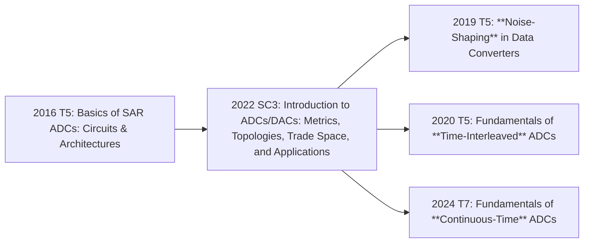

# ADDA

## Prerequisite

### Switch-Capacitor

### Introduction

- A Brief History of Data Conversion: A Tale of Nozzles, Relays, Tubes, Transistors, and CMOS
- FUNDAMENTALS OF SAMPLED DATA SYSTEMS, ADI
- Pieter Harpe @ TU/e
  - ISSCC 2016 [T05](https://resourcecenter.sscs.ieee.org/education/short-courses/sscstut20160090) - Basics of SAR ADCs Circuits & Architectures

### Comparator

[Keeping Things Quiet: A New Methodology for Dynamic Comparator Noise Analysis, Art Schaldenbrand, 2016](https://www.cadence.com/content/dam/cadence-www/global/en_US/videos/tools/custom-_ic_analog_rf_design/NoiseAnalyisposting201612Chalk%20Talk.pdf)

#### StrongARM

- 知乎
  - [再世孟子](https://zhuanlan.zhihu.com/p/598924151)
  - [王小桃](https://zhuanlan.zhihu.com/p/16672774067)

### ΣΔ Modulation

## Classic ADDA

### 做一个 10bit SAR 上手

#### 系统建模

https://www.mathworks.com/help/msblks/examples.html?category=data-converters&exampleproduct=all
https://www.mathworks.com/help/msblks/ug/adc-tutorial.html

https://www.mathworks.com/help/msblks/ug/successive-approximation-adc.html
https://www.mathworks.com/help/msblks/gs/DesignAndEvaluateSARADC.html

- Mixed-Signal Blockset (msblks)
  - [data-converters.html](https://www.mathworks.com/help/msblks/data-converters.html)
    - [saradc.html](https://www.mathworks.com/help/msblks/ref/)

#### 子模块

###  学习资源

ADDA 方向南京大学是有本科生选修课的？

- Boris Murmann @ Stanford → UH Mānoa
  - courseware
    - Stanford EE315A, EE315B
  - video
    - 2022 ISSCC Short Course: Introduction to ADCs/DACs: Metrics, Topologies, Trade Space, and Applications ⭐
  - https://github.com/bmurmann/ADC-survey
- Pieter Harpe (SAR-ADC) @ TU/e
  - 2016 ISSCC [T05](https://resourcecenter.sscs.ieee.org/education/short-courses/sscstut20160090) - Basics of SAR ADCs Circuits & Architectures ⭐⭐
  - 2016 SSC-M: [Successive Approximation Analog-to-Digital Converters: Improving Power Efficiency and Conversion Speed](https://ieeexplore.ieee.org/document/7743043)
  - Low-power SAR ADCs
    - 2019 ESSCIRC Paper: [Low-power SAR ADCs: trends, examples and future](https://ieeexplore.ieee.org/document/8902871)
    - 2019 ESSCIRC Video: [Low-Power SAR ADCs Presented by Pieter Harpe - YouTube](https://www.youtube.com/watch?v=BE9onmrGZhY)
    - 2019 OJSSCS Paper: [Low-Power SAR ADCs: Basic Techniques and Trends](https://ieeexplore.ieee.org/document/9908164)
  - 2022 ISSCC SC3: High Precision and Low Power ADCs
  - 2024 CICC: [Energy Efficient ADC Design Techniques](https://ieeexplore.ieee.org/document/10529035)
- Marcel J.M. Pelgrom @ NXP → Retired
  - book
    - 2022 Springer: Analog-to Digital Conversion, Fourth Edition ⭐⭐
    - 2023 Springer: Multi-Gigahertz Nyquist Analog-to-Digital Converters
- Ahmed M. A. Ali (Speed) @ ADI → Apple
  - book
    - 2016 IET: High Speed Data Converters (高速数据转换器设计)
- 孙楠 & 李福乐 @ THU
  - courseware / slides
    - https://bbs.eetop.cn/thread-953294-1-23.html
    - https://bbs.eetop.cn/thread-954969-2-90.html
    - https://bbs.eetop.cn/thread-943698-8-29.html
- 唐希源 @ PKU
  - 2022 TCASI: [Low-Power SAR ADC Design: Overview and Survey of State-of-the-Art Techniques](https://ieeexplore.ieee.org/document/9761973)
- UCB EE 247 (old), EE 240C (new)
- 朱樟明 @ XIDIAN
  - 《低功耗 CMOS 逐次逼近型模数转换器》
- Allen
  - 第二版

### 经典文献

| Title                                                        | Author                 | Year | IEEE/Google Scholar |
| ------------------------------------------------------------ | ---------------------- | ---- | ------------------- |
| [A 10-bit 50-MS/s SAR ADC With a Monotonic Capacitor Switching Procedure](https://ieeexplore.ieee.org/document/5437496) | Chun-Cheng (Jason) Liu | 2010 | 1000/1500           |

### 参考

- https://www.zhihu.com/question/429625678
- https://www.zhihu.com/question/553117936 ⭐
- https://www.zhihu.com/question/502632221
- https://www.zhihu.com/question/478487601
- https://www.zhihu.com/question/590222455
- https://www.zhihu.com/question/433785533

## Sensor Interface & Biomedical IC

| University | Course No. | Year / WebSite                                              | Name                | Teacher         | Video | Slide |
| ---------- | ---------- | ----------------------------------------------------------- | ------------------- | --------------- | ----- | ----- |
| TU Delft   | EE1320     | [2013](https://ocw.tudelft.nl/courses/measurement-science/) | Measurement Science | Michiel Pertijs | OCW   | OCW   |
|            |            |                                                             |                     |                 |       |       |

- Kofi Makinwa & Michiel Pertijs @ TU Delft
  - ESSCIRC 2007 PLENARY: Smart sensor design: The art of compensation and cancellation
  - ISSCC 2008 Tutorial: CMOS Temperature Sensors
  - ISSCC 2010 Short Course: Designing Smart Sensors (in Standard CMOS)
  - ISSCC 2014 Tutorial: Design of Physical-to-Digital Converters
  - VLSI 2016 VLSIx Circuit Insights: Smart Sensor Design
- Fan Qinwen @ TU Delft
  - Webinar 2022: Evolution of precision amplifiers

### Chopping & Auto-Zeroing & Dynamic Element Matching (DEM)

- Kofi Makinwa @ TU Delft
  - ISSCC 2007 Tutorial: Dynamic-Offset Cancellation Techniques in CMOS
  - ISSCCedu 2016: Chopper Amplifier Demystified
  - ESSCIRCedu 2018: Auto-Zeroing Demystified
  - IEEE Sensors 2018: Capacitively-Coupled Chopper Instrumentation Amplifiers: an Overview
  - ISSCC 2022 Circuit Insights: Coping with Variability
  - ESSCIRC 2023 Circuit Insights: The Power of Averaging

[Chopping Amp in Cadence Virtuoso](https://www.youtube.com/watch?v=gF8sOlK7TM8)

