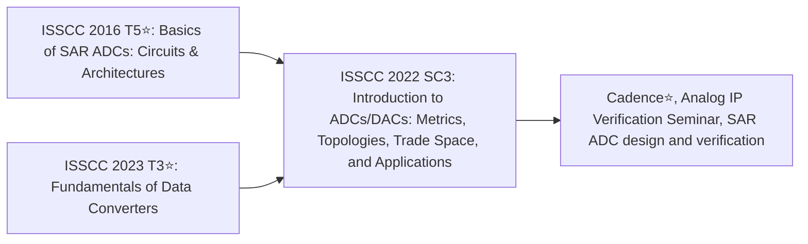

## Modules

### Bootstrap

todo

### Switch-Capacitor & Comparator

Move to [Mixed Signal](mixedsignal.md)

## 通用学习资源

ADDA 方向部分大学是有本科生选修课的

后文中 `⚡` 代表高速 (Nyquist) ADDA, `🎯` 代表高精度 (Oversampling) ADDA, `⭐` 代表精选/推荐/必读资源

### Introduction

```mermaid
graph LR
  SAR["ISSCC 2016 T5⭐: Basics of SAR ADCs: Circuits & Architectures"] --> FoM
  Fundamentals["ISSCC 2023 T3⭐: Fundamentals of Data Converters"] --> FoM
  FoM["ISSCC 2022 SC3: Introduction to ADCs/DACs: Metrics, Topologies, Trade Space, and Applications"] --> Cdns["Cadence⭐, Analog IP Verification Seminar, SAR ADC design and verification"]
```

- A Brief History of Data Conversion: A Tale of Nozzles, Relays, Tubes, Transistors, and CMOS
- FUNDAMENTALS OF SAMPLED DATA SYSTEMS, ADI

| Type              | Basic Intro     |
| ----------------- | --------------- |
| SAR               | ISSCC 2016 T5   |
| Noise-Shaping SAR | ISSCC 2019 T5   |
| Continuous-Time   | ISSCC 2024 T7   |
| Time-Domain       | ISSCC 2025 F4.7 |
| Time-Interleaving | ISSCC 2020 T5   |
| ADC-based Serdes  | ISSCC 2018 T10  |

### Checklist

### Boris Murmann @ Stanford → UH Mānoa

- 一句话介绍: ADC FoM 经典表格的 maintainer
- courseware
  - Stanford EE315A, EE315B
- conference
  - 2013 CICC T: A/D Converter Circuit and Architecture Design for High-Speed Data Communication
  - 2023 ESSCIRC: Digitally Assisted Data Converter Design
  - 2022 ISSCC SC1: Introduction to ADCs/DACs: Metrics, Topologies, Trade Space, and Applications ⭐
  - 2026 ISSCC F6.1: Data Converter Calibration: Motivation, Evolution, and General Aspects
- https://github.com/bmurmann/ADC-survey

### Manar El-Chammas ⚡ @ TI → Omni Design

- conference
  - ISCAS 2009: General analysis on the impact of phase-skew in time-interleaved ADCs
  - ICECS 2011 T: Time-Interleaved ADCs Theory and Design
  - NEWCAS 2012 T: The World of Time-Interleaved ADCs from theory to design
  - ISSCC 2017 F6: Design Techniques for Multi-GSs and High Performance Pipelined ADCs
  - AUB Talks Semantic Communications 2024: The hardware behind the algorithms: A look at energy-efficient transievers and accelerators
- book
  - 2024 High-Performance and High-Speed Pipelined ADCs (z-lib + tor)

### Pieter Harpe @ TU/e

- conference
  - 2016 ISSCC [T05](https://resourcecenter.sscs.ieee.org/education/short-courses/sscstut20160090) - Basics of SAR ADCs Circuits & Architectures ⭐⭐
  - 2016 SSC-M: [Successive Approximation Analog-to-Digital Converters: Improving Power Efficiency and Conversion Speed](https://ieeexplore.ieee.org/document/7743043)
  - Low-power SAR ADCs
    - 2019 ESSCIRC Paper: [Low-power SAR ADCs: trends, examples and future](https://ieeexplore.ieee.org/document/8902871)
    - 2019 ESSCIRC Video: [Low-Power SAR ADCs Presented by Pieter Harpe - YouTube](https://www.youtube.com/watch?v=BE9onmrGZhY)
    - 2019 OJSSCS Paper: [Low-Power SAR ADCs: Basic Techniques and Trends](https://ieeexplore.ieee.org/document/9908164)
  - 2022 ISSCC SC3: High Precision and Low Power ADCs
  - 2024 CICC: [Energy Efficient ADC Design Techniques](https://ieeexplore.ieee.org/document/10529035)
  - 2025 ASSCC: [Circuits for Data Conversion](https://www.youtube.com/watch?v=dDKxcVIHDjg&list=PLvYonHCKSWainhipdNmCATbT_zvK1rlnB&index=2)
 
### Marcel J.M. Pelgrom @ TU Delft / NXP → Retired ⭐

- 一句话介绍: ADC 领域的真正专家
- book
  - 2022 Springer: Analog-to Digital Conversion, Fourth Edition ⭐⭐
- conference
  - ISSCC 2017 F: Pushing the Boundaries of Performance - A Technology Perspective
  - 2020 SSCS-EDS South Brazil Distinguished Talk: [ADC Performance Limits - The Fundamentals](https://www.youtube.com/watch?v=doTHd0W9QhA)

### Behzad Razavi @ UCLA

- book
  - 2025 Cambridge: Analysis and Design of Data Converters ⭐⭐
- journal
  - 建议直接阅读书即可，例如 Bootstrap SSC-M, StrongARM SSC-M, TIADC 2013 JSSC 等文章都重新被整理并扩写成了 ADC 的书
- conference
  - 2020 ISCAS: Lower Bounds on Power Consumption of Clock Generators for ADCs
- courseware (not recommended)
  - 2012 EE215D: https://www.seas.ucla.edu/brweb/teaching/215D_S2012/

### 邱云 Yun Chiu @ UT Dallas

- courseware
  - 2025 EECT 7327: https://personal.utdallas.edu/~yxc101000/courses/7327/handout.html
- conference
  - mwscas 2012: Recent Advances in Multistep Nyquist ADC’s
  - ISSCC 2023 T3: Fundamentals of Data Converters

### 陳碩偉 Mike Shuo-Wei Chen @ USC

- 一句话介绍: 现代异步 SAR-ADC (比较器 Valid 信号作为自驱动时钟) 的提出者; ISSCC, JSSC 2006
- conference
  - CICC 2017 26-5: Emerging Trend in High-Speed DAC Design
  - CICC 2018 T: Evolutions of SAR ADC: From high resolution to high speed regime
  - CICC 2022 15: High-Speed Digital-to-Analog Converter Design Towards High Dynamic Range 
  - ISSCC 2025 F4.4: High-Speed DAC Architectures and Techniques Towards High Dynamic Range, Bandwidth and Output Power
- paid
  - hoomanreyhani 2021: Advanced Data Converters

### Michael P. Flynn @ UMich 

- conference
  - CICC 2015: ADC Trends and Impact on SAR ADC Architecture and Analysis
  - ASSCC 2017 T1: ADC hybrids and ADC morphing
  - ISSCC 2017 F: Best of Both Worlds Hybrid Data Converters
  - ISSCC 2018 edu: Evolutional of the SAR ADC
  - VLSI 2020 SC3-2: The noise-shaping SAR ADC techique: The best of both worlds

### Ewout Martens @ imec

- conference
  - ESSCIRC 2019 T: Advanced Techniques for ADCs for 5G Massive MIMO Presented
  - CICC 2023: Calibration Techniques for Optimizing Performance of High-Speed ADCs

### IBM

#### Lukas Kull @ IBM → Cisco 

- conference
  - CICC 2017 4-3: Measurement of high-speed ADCs

#### Timothy (Tod) Dickson @ IBM

- conference
  - CICC 2023 3-2: High-Speed DAC Design in 4nm FinFET for 200+ Gb/s Wireline Transmitters
  - CICC 2024 23-1: Digital-to-Analog Converters for 100+ Gb/s Wireline Transmitters: Architectures, Circuits, and Calibration

### Sam Palermo @ Texas A&M University

- conference
  - ISSCC 2026 F: Calibration Techniques for High‑Speed Time‑Interleaved Time‑Domain ADCs

### Aaron Buchwald ⚡ @ Entropic → Inphi → Aeonsemi

- conference
  - ISSCC 2010 T3: Specifying and Testing ADCs
  - CICC 2015: Practical considerations for application specific time interleaved ADCs
  - VLSI 2016 SC3: ADCs for PAM-X / QAM-X Backplane and Optical Data Links
  - CICC 2017 S2-1: A Supposedly Clever Thing I’ll Never Do Again
  - CICC 2018 T2: Time Interleaved ADCs Requirements vs. Application
- journal
  - 2016: High-speed time interleaved ADCs

### Keysight ⚡

#### Ken Poulton

- conference
  - ISSCC 2015 F1: Interleaved ADCs Through the Ages

#### John P. Keane

- conference
  - ISSCC 2020 T5: Fundamentals of Time-Interleaved ADCs ⭐

#### Kenneth C. Dyer

- conference
  - 2016 ISSCC F2: Calibration and Dynamic Matching in Data Converters
- journal
  - 2018 SSC-M: Calibration and Dynamic Matching in Data Converters: Part 1, Part 2

### ADI

#### Walt Kester @ ADI

- book
  - 2005 ADI: Data Conversion Handbook
- MT series ADI
  - MT-001 to MT-031

#### David H. Robertson⚡@ ADI

- conference
  - ESSCIRC 2016: Data converter reflections: 19 papers from the last ten years that deserve a second look ⭐
  - CICC 2017 26-1: Stranger Things: Problems, Solutions, and Possible Trends in High Speed Data Conversion
- journal
  - SSC-M 2015: Problems and Solutions: How Applications Drive Data Converters (and How Changing Data Converter Technology Influences System Architecture)

#### Ahmed M. A. Ali ⚡ @ ADI → Apple
    
- book
  - 2016 IET: High Speed Data Converters 《高速数据转换器设计》
- conference
  - CICC 2018 T: High Speed Pipelined ADCs: Fundamentals and Variants
  - ISSCC 2021 T05: Calibration Techniques in ADCs

#### Huseyin Dinc ⚡ @ ADI

- conference
  - CICC 2025 ES2.4: Digital Calibration Techniques for High-Speed Pipelined ADCs
  - ISSCC 2026 F6.2: Background Calibration of High-Speed Pipelined ADCs: Methods, Limitations and Practical Considerations

#### Ron Kapusta ⚡ @ ADI

- conference
  - ISSCC 2017 F6-: Advanced SAR ADCs for high-throughput applications

#### Jesper Steensgaard 🎯 @ ADI

- conference
  - ISSCC 2021 F2.8: Intrinsically-Linear Data Converters

#### Hajime Shibata @ ADI

- conference
  - ISSCC 2023 F5.3: Continuous-Time Pipelined ADC: A Breed of Continuous-Time ADCs for Ultra-Wideband Conversion

#### Sharvil Patil @ ADI

- conference
  - ISSCC 2025 F4.3: Developments and Challenges in High-Speed Continuous-Time ADCs for Wideband Wireless Communications

### MediaTek

#### Gabriele Manganaro @ ADI → MediaTek

- book
  - Cambridge 2012: Advanced Data Converters
- conference
  - CICC 2018: Emerging data converter architectures and techniques
  - CICC 2020 ES4-3: Current Steering D/As
  - ISSCC 2022 SC2: Ultra-High-Data-Rate ADCs and DACs: Architectures and Implementations
  - ESSERC 2024: Rethinking mixed-signal IC design
  - ISSCC 2026 F6.5: Calibration for high-speed, high-resolution DACs
- journal
  - OJSSC 2022: An Introduction to High Sample Rate Nyquist Analog-to-Digital Converters
  - SSC-M 2022: An introduction to high data rate current-steering Nyquist DACs: Fasten your seat belts
- talks
  - SSCS Webinar 2020: Mixed-signal technologies for ultra-wide band signal processing systems
  - CASS Talks 2024: https://www.youtube.com/watch?v=UMWmVuoxmww

#### Tamer Ali

- conference
  - CICC 2023 3.1: Data Converters for 200+Gbps Wireline Links and Transceivers

### Texas Instruments

#### Venkatesh Srinivasan

- conference
  - ISSCC 2019 T5: Noise-Shaping in Data Converters

### Broadcom

#### 曹军

- conference
  - ISSCC 2019 F6.7: Multi-GS/s Data Converters for High-Speed Wireline and Optical Links

#### 张恒

- conference
  - ISSCC 2025 F4.2: High-speed ADCs for 100Gbps+ Wireline Transceivers

### NXP

#### Muhammed Bolatkale

- conference
  - ISSCC 2025 F4.5: High-performance Noise-shaping ADCs

#### Lucien Breems

- conference
  - ESSERC 2024: Fundamentals on High-Performance Continuous-Time ADC’s

#### Kostas Doris

- conference
  - ISSCC 2015 F1.6: GS/s Time-Interleaved ADCs for Broadband Multi-Carrier Signal Reception 
  - ESSERC 2024: Fundamentals on High-Performance Continuous-Time ADC’s

#### Maarten Molendijk

- conference
  - ESSERC 2024: Machine Learning-Based Calibration of Analog-to-Digital Converters

### Alphawave

#### Tony Chan Carusone

- conference
  - CICC 2023 3-3: Precision Clocking for High-Speed Data Converters
- journal
  - JSSC 2026: Modern Wireline Transceivers
 
### AMD

#### Athanasios Ramkaj

- paper
  - 2022 SSC-M: In the Pursuit of the Optimal Accuracy–Speed–Power Analog-to-Digital Converter Architecture: A mathematical framework
- book
  - 2023 Springer: Multi-Gigahertz Nyquist Analog-to-Digital Converters

### Samsung

#### Ben (Hyo-Gyuem) Rhew

- conference
  - ISSCC 2023 F: High-Speed ADC Design in Wireline and Wireless Applications

### 孙楠, 揭路 @ THU ⭐

- courseware / slides
  - 孙楠 ADC intro @THU: https://bbs.eetop.cn/thread-953294-1-23.html
  - 孙楠 2014 @UT Austin: https://bbs.eetop.cn/thread-954969-1-90.html
  - 孙楠 2021 @THU: https://bbs.eetop.cn/thread-943698-1-29.html
- conference
  - 孙楠 CICC 2017 26-4: Emerging Data Conversion Architectures 
  - 孙楠 ISSCC 2022 SC4: Emerging Data Converter Concepts
  - 孙楠 Webinar: Break the kT over C Noise Limit
  - 揭路 ASSCC 2025 T1: Noise-Shaping SAR ADC: Design, Development, and Deployment
- journal
  - 揭路 OJSSC 2021: An Overview of Noise-Shaping SAR ADC: From Fundamentals to the Frontier

### 唐希源, 沈林晓 @ PKU

- conference
  - 沈林晓 ISSCC 2025 F4.8：High-Performance Discrete-Time Amplifiers Utilizing Time-Varying Settling Processes
  - 唐希源 CICC 2025 ES2.1: Noise-Shaping SAR ADCs: From Fundamentals to Recent Advances
- journal
  - 唐希源 
  - 唐希源 [Low-Power SAR ADC Design: Overview and Survey of State-of-the-Art Techniques](https://ieeexplore.ieee.org/document/9761973)

### 李福乐 

- SAR 2019 @THU: https://bbs.eetop.cn/thread-959512-1-1.html

### 陈知行, 张明磊⚡ @ University of Macau

- conference
  - 陈知行 CICC 2024: The Race for the Extra Pico Second without Losing the Decibel: A Partial-Review of Single-Channel Energy-Efficient High-Speed Nyquist ADCs
  - 陈知行 ASSCC 2024: Mechanisms for accelerating ADC speed: Quantization shortcuts
  - 张明磊 ISSCC 2025 F4.7: Extending ADC Performance Through TDC-Assisted Quantization in Multiple Dimensions
  - 陈知行 OJSSC 2026: Beyond Sole Parametric Optimization Design Regimes: Understanding and Advancing the Frontiers of High-Speed ADCs
- paid
  - 陈知行 hoomanreyhani 2024: Extreme SAR ADCs

### Shanthi Pavan @ IIT

- book
  - Wiley 2017: Understanding Delta-Sigma Data Converters
- conference
  - ISSCC 2013 T5: Simulation Techniques in Data Converter Design
  - ISSCC 2021 F2.7: Architectural and Design Challenges in High-Resolution Continuous-Time Delta-Sigma Data Converters
  - VLSI 2021 WS3.4: Delta-Sigma A/D Converter Design
  - ISSCC 2024 T7: Fundamentals of Continuous-Time ADCs
  - ESSERC 2024: The Rise and Rise ofContinuous-Time ADCs
- journal
  - TCAS-II 2021: Continuous-Time Pipelined Analog-to-Digital Converters: A Mini-Tutorial
  - SSC-M 2024: Fundamentals of Continuous-Time ADCs: Part 1 /2: The Continuous-Time Pipeline / Delta–Sigma Converters

### Cadence

- ADC Verification Rapid Adoption Kit ⭐ [eetop download](https://bbs.eetop.cn/thread-964432-1-1.html) ⭐
- Analog IP Verification Seminar, SAR ADC design and verification ⭐ [eetop download](https://bbs.eetop.cn/thread-969302-1-1.html) [link2](https://pan.baidu.com/s/1TNBDKtl22S0xxORziXMdsg?pwd=sjxj)

### Paid

- eeeknow.com 移知
  - 高速异步 SAR ADC 设计实战 ⭐
  - 30 天学会 Sigma-Delta(Σ-Δ) ADC 设计
  - Current Steering DAC 的 Matlab 建模与电路设计
- icdesign.com
  - 比较器
  - SAR ADC
  - Current Steering DAC

### Courseware

- UC Berkeley
  - EE 247 (old), EE 240C (new)
  - EECS 247 Analog-Digital Interface Integrated Circuits by Haideh Khorramabadi
- Vishal Saxena
  - ECE 615 Mixed Signal IC Design Delta Sigma - Fall 2013 on YouTube
  - ECE 4/517 MIXED SIGNAL - Spring 2017 with Slides

### Others

- 朱樟明 @ XIDIAN
  - 《低功耗 CMOS 逐次逼近型模数转换器》
- Allen
  - 第二版

### MATLAB

https://www.mathworks.com/help/msblks/examples.html?category=data-converters&exampleproduct=all
https://www.mathworks.com/help/msblks/ug/adc-tutorial.html

https://www.mathworks.com/help/msblks/ug/successive-approximation-adc.html
https://www.mathworks.com/help/msblks/gs/DesignAndEvaluateSARADC.html

- Mixed-Signal Blockset (msblks)
  - [data-converters.html](https://www.mathworks.com/help/msblks/data-converters.html)
    - [saradc.html](https://www.mathworks.com/help/msblks/ref/)
   

## Nyquist ADC (⚡高速)

### Flash ADC

### SAR ADC

| Title                                                        | Author                 | Year | IEEE/Google Scholar |
| ------------------------------------------------------------ | ---------------------- | ---- | ------------------- |
| [A 10-bit 50-MS/s SAR ADC With a Monotonic Capacitor Switching Procedure](https://ieeexplore.ieee.org/document/5437496) | Chun-Cheng (Jason) Liu | 2010 | 1000/1500           |

### Pipeline ADC

#### RA

- ISSCC 2024 T1: Process-Scalable Low-Power Amplifier
- SSC-M 2024: Process-Scalable and Low-Power Amplifiers: Progress and prospects in dynamic amplifier research

##### Ring Amp by [Benjamin Hershberg](https://ieeexplore.ieee.org/author/37399879200)

- Benjamin Hershberg @ Intel
  - CICC 2020: Ringamp - The Scalable Amplifier We’ve All Been Waiting For?
    - video: [Ring Amplifier (Ringamp) Tutorial - YouTube](https://www.youtube.com/watch?v=uPFCcgjS5Zk)
    - slides: [PowerPoint Presentation](https://www.benjamin.hershberg.com/wp-content/papercite-data/slides/2020-cicc-invited-talk.pdf)
    - (the very first) paper: [Ring Amplifiers for Switched Capacitor Circuits, 2012, JSSC](https://ieeexplore.ieee.org/document/6373760)
  - Personal website: https://www.benjamin.hershberg.com/

### Clocking

The Speed–Power Trade-Off in the Design of CMOS True-Single-Phase-Clock Divider

## Oversampling ADC (🎯高精度)

### ΣΔ Modulation

## Sensor Interface & Biomedical IC

| University | Course No. | Year / WebSite                                              | Name                | Teacher         | Video | Slide |
| ---------- | ---------- | ----------------------------------------------------------- | ------------------- | --------------- | ----- | ----- |
| TU Delft   | EE1320     | [2013](https://ocw.tudelft.nl/courses/measurement-science/) | Measurement Science | Michiel Pertijs | OCW   | OCW   |
|            |            |                                                             |                     |                 |       |       |

- Kofi Makinwa & Michiel Pertijs @ TU Delft
  - ESSCIRC 2007 PLENARY: Smart sensor design: The art of compensation and cancellation
  - ISSCC 2008 Tutorial: CMOS Temperature Sensors
  - ISSCC 2010 Short Course: Designing Smart Sensors (in Standard CMOS)
  - ISSCC 2014 Tutorial: Design of Physical-to-Digital Converters
  - VLSI 2016 VLSIx Circuit Insights: Smart Sensor Design
- Fan Qinwen @ TU Delft
  - Webinar 2022: Evolution of precision amplifiers

### Chopping & Auto-Zeroing & Dynamic Element Matching (DEM)

- Kofi Makinwa @ TU Delft
  - ISSCC 2007 Tutorial: Dynamic-Offset Cancellation Techniques in CMOS
  - ISSCCedu 2016: Chopper Amplifier Demystified
  - ESSCIRCedu 2018: Auto-Zeroing Demystified
  - IEEE Sensors 2018: Capacitively-Coupled Chopper Instrumentation Amplifiers: an Overview
  - ISSCC 2022 Circuit Insights: Coping with Variability
  - ESSCIRC 2023 Circuit Insights: The Power of Averaging

[Chopping Amp in Cadence Virtuoso](https://www.youtube.com/watch?v=gF8sOlK7TM8)

## 参考

- https://www.zhihu.com/question/429625678
- https://www.zhihu.com/question/553117936 ⭐
- https://www.zhihu.com/question/502632221
- https://www.zhihu.com/question/478487601
- https://www.zhihu.com/question/590222455
- https://www.zhihu.com/question/433785533

资料收集原则：尽量只收集 2010 年及以后的资料，理由：

1. 再经典的资料也会过时的
